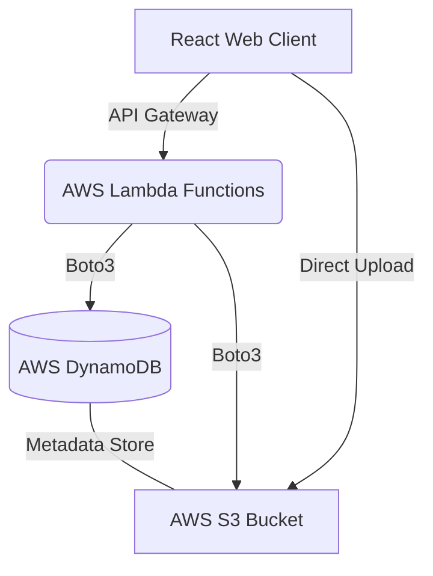

# 🛡️ H-Drive: Secure Serverless Cloud Storage -> (Currently A MVP)


**H-Drive** is a modern, serverless cloud storage solution designed to provide a secure and efficient way to store, manage, and access files in the cloud. Built with a React frontend and an AWS-powered backend, it leverages the scalability and security of industry-leading cloud services.

---

## 🌟 Key Features

-   **🔐 Secure Authentication**: Integrated user login system powered by AWS DynamoDB.
-   **📤 Smart Uploads**: Directly upload files to AWS S3 using secure pre-signed URLs, minimizing server load.
-   **📁 File Management**: View your files in a clean, grid-based dashboard with real-time metadata.
-   **🔗 Instant Access**: Generate temporary access links for secure file downloads.
-   **📊 Storage Monitoring**: Track your storage usage with a dynamic progress bar (10 GB free tier).
-   **🗑️ Easy Deletion**: One-click file removal that synchronizes both storage and metadata.
-   **📱 Responsive Design**: Fully optimized for both desktop and mobile viewing.

---

## 🛠️ Tech Stack

### Frontend
-   **React 19**: Modern UI library for building dynamic interfaces.
-   **Vite**: Next-generation frontend tooling for fast development.
-   **Vanilla CSS**: Custom, high-performance styling for a premium feel.
-   **Lucide React**: (Optional/Planned) For beautiful iconography.

### Backend (Serverless)
-   **AWS Lambda**: Event-driven Python functions for processing logic.
-   **AWS API Gateway**: Secure endpoints for frontend-backend communication.
-   **Python 3.x**: The logic behind the Lambda functions.

### Storage & Database
-   **AWS S3 (Simple Storage Service)**: Scalable object storage for files.
-   **AWS DynamoDB**: High-performance NoSQL database for file metadata and user accounts.

---

## 🏗️ Architecture Overview



1.  **Client-Side**: The React app requests a pre-signed URL from Lambda.
2.  **Logic Layer**: Lambda generates the URL and updates DynamoDB.
3.  **Storage Layer**: The client uploads the file directly to S3 using the URL.
4.  **Display**: Metadata is fetched from DynamoDB to show the file list in the UI.

---

## 📂 Project Structure

```text
HS3/
├── AWS_Lambda_Codes/       # Backend Python logic for AWS
│   ├── metaDataDeleter.py  # Cleans up file metadata
│   ├── metaDataUploader.py # Stores file details in DynamoDB
│   ├── s3Deleter.py        # Deletes files from S3
│   ├── s3Uploader.py       # Handles uploads & pre-signed URLs
│   └── userLogin.py        # Authentication logic
├── Project_Documentation/   # Design assets and project docs
│   ├── Images/             # Screenshots and diagrams
│   └── Project Abstract.docx
├── src/                    # Frontend React application
│   ├── App.jsx             # Main dashboard logic
│   ├── upload.jsx          # File upload component
│   ├── login.jsx           # User authentication screen
│   ├── dataDisplayerCard.jsx# Individual file preview card
│   └── ...css              # Modular CSS files
├── index.html              # Entry point
└── package.json            # Project dependencies
```

---
=======
# HS3 (H-Drive) 🚀
**A Secure, Serverless Cloud Storage Solution**

HS3 is a high-performance personal cloud storage application. It leverages a serverless architecture to provide seamless file management, including secure uploads, deletions, and metadata tracking.

## 🏗️ Architecture
The project is split into two main components:
* **Frontend:** A modern, reactive UI built with [Vite](https://vitejs.dev/).
* **Backend:** Serverless logic powered by [AWS Lambda](https://aws.amazon.com/lambda/) (Python) and [Amazon S3](https://aws.amazon.com/s3/).

## ✨ Key Features
* **Secure Authentication:** Managed via `userLogin.py`.
* **File Management:** Upload and delete files directly to/from S3.
* **Metadata Tracking:** Automatic metadata handling via specialized Lambda functions.
* **Automated Deployment:** Includes a `deploy.sh` script for rapid iteration.

## 🛠️ Tech Stack
* **Frontend:** JavaScript, Vite, CSS
* **Backend:** Python 3.x, Boto3 (AWS SDK)
* **Cloud:** AWS Lambda, S3, API Gateway
>>>>>>> b256219fde9a35ec039a12e7ade2cb7aecc90333

## 🚀 Getting Started

### Prerequisites
<<<<<<< HEAD
-   **Node.js** (v18 or higher)
-   **npm** or **yarn**
-   **AWS Account** (with S3, DynamoDB, and Lambda configured)

### Installation

1.  **Clone the repository**:
    ```bash
    git clone https://github.com/your-username/h-drive.git
    cd h-drive
    ```

2.  **Install dependencies**:
    ```bash
    npm install
    ```

3.  **Configure Environment**:
    Create a `.env` file in the root and add your API Gateway URL:
    ```env
    VITE_API_URL=https://your-api-id.execute-api.region.amazonaws.com/prod
    ```

4.  **Run Development Server**:
    ```bash
    npm run dev
    ```

---

## 🛡️ Security Best Practices

-   **Pre-signed URLs**: All file transfers happen via short-lived URLs, ensuring no long-term exposure.
-   **CORS Configuration**: API Gateway and S3 are configured to only allow requests from trusted origins.
-   **Environment Separation**: Metadata and actual file storage are decoupled for better integrity.

---

## 🗺️ Roadmap

-   [ ] **Folder Support**: Organize files into virtual directories.
-   [ ] **Shareable Links**: Generate public links with expiration dates.
-   [ ] **Dark Mode**: Enhanced UI themes for better accessibility.
-   [ ] **File Versioning**: Undo accidental deletions or edits.
-   [ ] **JWT Integration**: Enhance session security.

---

## 📄 License

This project is licensed under the MIT License - see the [LICENSE](LICENSE) file for details.

---

Developed with ❤️ by the H-Drive Team.
=======
* Node.js (v18+)
* AWS CLI configured with appropriate permissions

### Installation
1. Clone the repository:
   ```bash
   git clone [https://github.com/Kanaka-Harsha/HS3.git](https://github.com/Kanaka-Harsha/HS3.git)
   cd HS3
>>>>>>> b256219fde9a35ec039a12e7ade2cb7aecc90333
